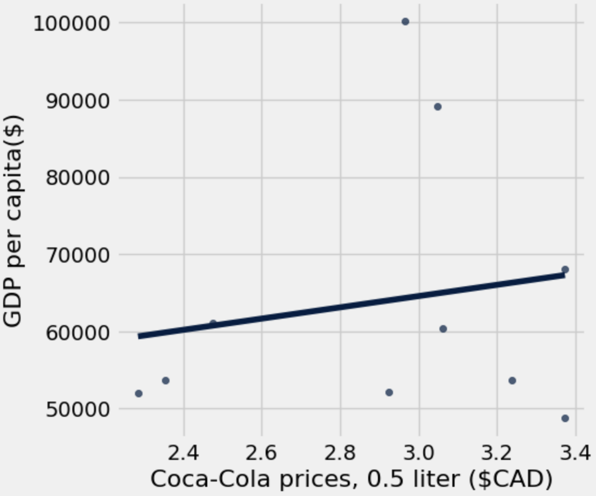

# The Coca-Cola Index

1. Scraping Data
   - https://www.globalproductprices.com/rankings/coca_cola_price/
   - https://wisevoter.com/country-rankings/gdp-by-country/
   - https://divercitytimes.com/economy/currency/currency
   Data was scraped from these three sites to make the charts and tables used on this website

2. Cleaning up and organizing data.
   - Combining the Price, GDP and Currency data to form 1 table of information
   - Converting the Price from USD to CAD for all countries data
   - Dropping Columns not need for the analysis
  

  
3. The graph below displays the Coca-Cola price in selected nations compared to the price in CAD

To establish wether or not GDP and Price are correlated the following Scatter Plot was generated

In conclusion there is no correlation between the GDP of a nation and the Price of Coca-Cola

A more likely reason behind the price differences found is licensing agreements for distribution and production within nations as well as royalities and external factors related to the health of the nations respective economy.
