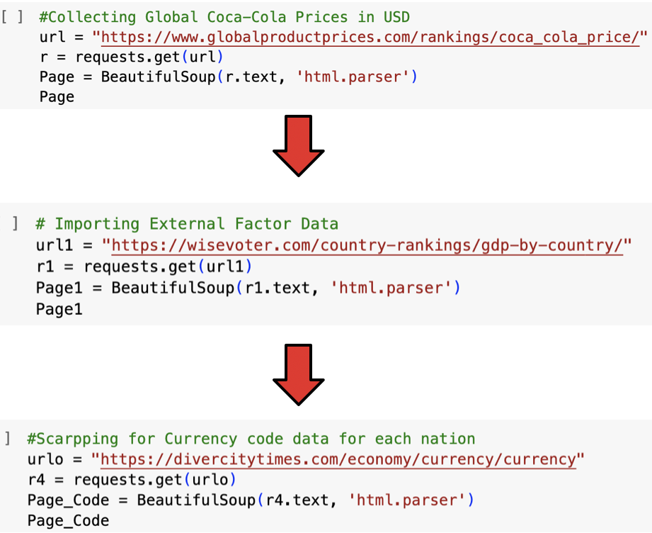

The Coca Cola Index:

1. Scraping Data
   - https://www.globalproductprices.com/rankings/coca_cola_price/
   - https://wisevoter.com/country-rankings/gdp-by-country/
   - https://divercitytimes.com/economy/currency/currency
     
   Data was scraped from these three sites to make the charts and tables used on this website.
   - The first site contained information pertaining to the price of Coca-Cola and their respective countries
   - The second focuses on those countries corresponding GDPs
   - The last includes the countries currency codes

   The code used to scrape the three tables is shown below.

   
   The following table shows a ten country sample of the data collected.

2. Cleaning up and organizing data.
   - Combining the Price, GDP and Currency data to form 1 table of information
   - Converting the Price from USD to CAD for all countries data
   - Dropping Columns not need for the analysis

3. In depth view of functions used for cleaning.
   
In order to make the scatterplot and bar graph seen later on in the site possible GDP per capita and Price colunms had to be converted.
Using a Lamda function and item.split the $ is removed and all integers are converted to floats.

The following array was generated in order to create the rightmost column that allows for comparison between the canadian price and the local price.

4. The following table shows the cleaned and organized data table.

5. The following table shows a ten country sample of the data collected.

  
6. The graph below displays the Coca-Cola price in selected nations compared to the price in CAD
   Notice that all countries shown in the graph contain prices significantly higher than the Canadian Price.

To establish whether or not GDP and Price are correlated the following Scatter Plot was generated

The Graph produced a correlation of  -0.2361754.
In conclusion as a result of this, there is no correlation between the GDP of a nation and the Price of Coca-Cola

7. A more likely reason behind the price differences found is licensing agreements for distribution and production within nations as well as royalities and external factors related to the health of the nations respective economy.
